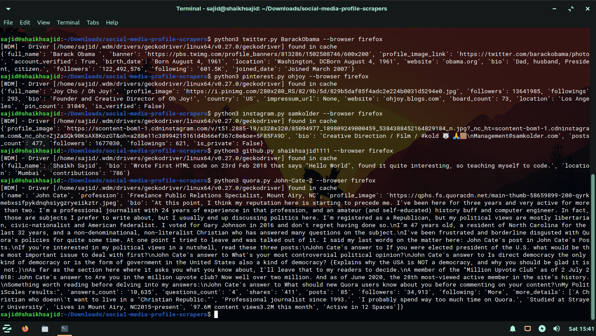

# Social Media Profile Crawlers

> These are the collections of scripts that scrape's social media profiles

[](https://www.python.org/)
[](https://github.com/shaikhsajid1111/social-media-profile-scrapers/graphs/commit-activity)
[](https://opensource.org/licenses/Apache-2.0)


## Available Social Media
* Twitter
* Facebook
* Instagram
* Reddit
* TikTok
* Medium
* Quora
* Pinterest
* Github


## Installation

1. Install dependencies mentioned inside [requirement.txt](requirement.txt) by opening terminal in project's directory and enter command
    ```
    pip install -r requirement.txt
    ```
## Usage

1. Open terminal in project's directory and enter command
    ```
    python SCRIPT_NAME USERNAME --browser BROWSER_NAME
    ```
    example
    ```
    python twitter.py barackObama --browser firefox
    ```
    if ```--browser``` argument is not passed, chrome is used by default. **currently only firefox and chrome is supported**
    - for more help enter command
    ```
    python SCRIPT_NAME -h
    ```
    example
    ```
    python instagram.py -h
    ```
    Note: Pinterest, Medium and Twitter script doesn't need browser. Just use it like ```python pinterest.py username```
## Tech

- [chromedriver](https://chromedriver.chromium.org) or [gecko Driver](https://github.com/mozilla/geckodriver/releases)
- [selenium](https://selenium-python.readthedocs.io/installation.html)
- [fake-headers](https://pypi.org/project/fake-headers/)
- [wedriver_manager](https://pypi.org/project/webdriver-manager/)


## Screenshot



## LICENSE

### Apache License 2.0

**If You have suggestions for more social media. Let me know :wink:**


