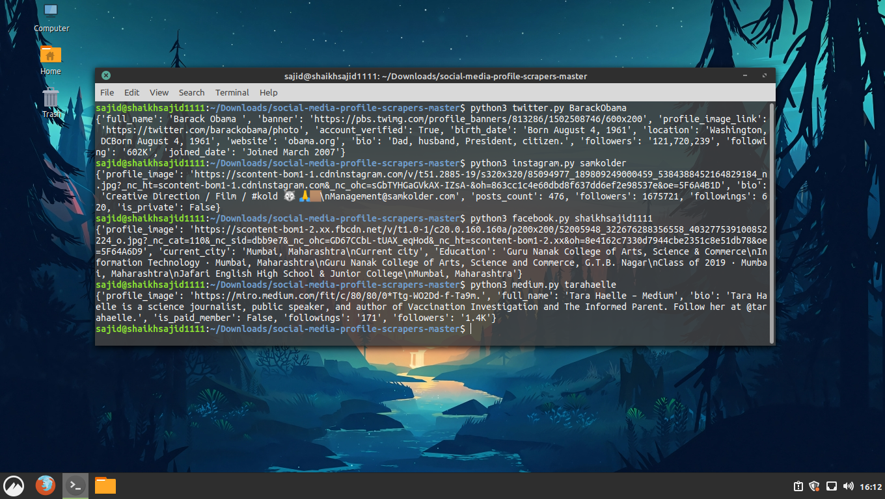

# Social Media Profile Crawlers


[](https://www.python.org/)
[](https://github.com/shaikhsajid1111/social-media-profile-scrapers/graphs/commit-activity)
[](https://opensource.org/licenses/Apache-2.0)


## Available Social Media
- Twitter :+1:
- Facebook :+1:
- Instagram :+1:
- Reddit :+1:   
- tiktok :+1:
- Medium :+1:
- Quora :+1:
- Pinterest :+1:
- Github :+1:


## Installation

1. You need person's social media username to fetch detail

1. Install dependencies mentioned inside [requirement.txt](requirement.txt) by opening terminal in project's directory and entering command ```pip install -r requirement.txt``` and make sure that you have setup either geckodriver or chromedriver. 
 **Browser's version must be compatible with driver's version**. See how to setup for [Firefox](https://stackoverflow.com/questions/42204897/how-to-setup-selenium-python-environment-for-firefox), [Chrome.](https://chromedriver.chromium.org/getting-started)

1. Edit [settings](settings.ini), enter your driver's path and browser's name accordingly. So, script can setup according to your configurations.
    e.g
    ```ini
    [DRIVER]
    PATH=/usr/bin/chromedriver
    BROWSER=chrome
    ``` 

1. Run script by opening terminal in project's directory and enter command ```python SCRIPT_NAME USERNAME```, for more help enter command ```python SCRIPT_NAME -h``` . 


## Tech

- [chromedriver](https://chromedriver.chromium.org) or [gecko Driver](https://github.com/mozilla/geckodriver/releases)
- [selenium](https://selenium-python.readthedocs.io/installation.html)
- [fake-headers](https://pypi.org/project/fake-headers/)   





## LICENSE 

### Apache License 2.0                                 

**If You have suggestions for more social media. Let me know :wink:**


