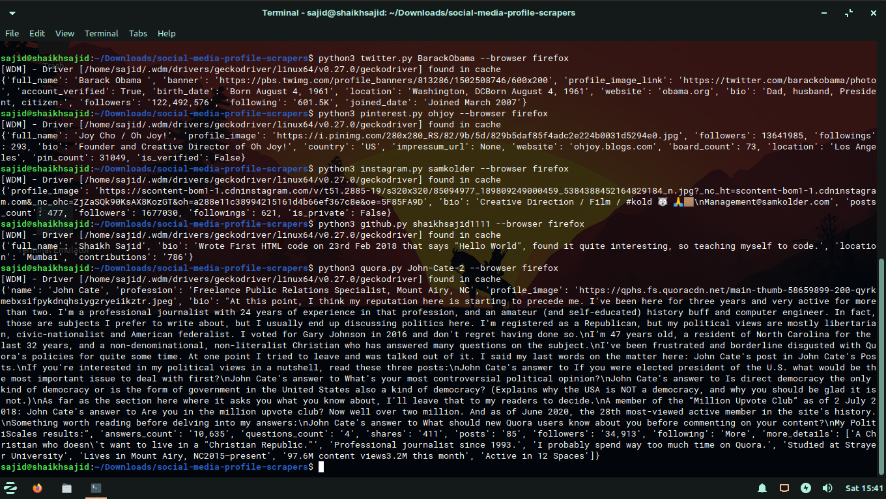

# Social Media Profile Crawlers

> These are the collections of scripts that scrape's social media profiles

[](https://www.python.org/)
[](https://github.com/shaikhsajid1111/social-media-profile-scrapers/graphs/commit-activity)
[](https://opensource.org/licenses/Apache-2.0)


---
## ⚡ Sponsor

### **[CoreClaw](https://www.coreclaw.com/?utm_source=github&utm_medium=referral&utm_campaign=social&utm_term=social&utm_id=social) — Web Scraping Platform & Ready-to-Use Data Extraction Tools**

[](https://www.coreclaw.com/?utm_source=github&utm_medium=referral&utm_campaign=social&utm_term=social&utm_id=social)

[CoreClaw](https://www.coreclaw.com/?utm_source=github&utm_medium=referral&utm_campaign=social&utm_term=social&utm_id=social) provides **100+ ready-to-use data scraping tools** for platforms like Amazon, TikTok, Google Maps, Instagram, Facebook, YouTube, and more.

*   **🚫 No Coding Required** — Extract structured data effortlessly.
*   **🔄 Flexible Formats** — Export seamlessly to JSON or CSV format.
*   **🛡️ Pay-Per-Success** — Only pay for successful results with no wasted budget on failed extractions.

### 🎁 Special Offer
**[Get started with a free $3 trial today!](https://www.coreclaw.com/?utm_source=github&utm_medium=referral&utm_campaign=social&utm_term=social&utm_id=social)**
---


## Available Social Media
* Twitter
* Facebook
* Instagram
* Reddit
* TikTok
* Medium
* Quora
* Pinterest
* Github


## Installation

1. Install dependencies mentioned inside [requirement.txt](requirement.txt) by opening terminal in project's directory and enter command
    ```
    pip install -r requirement.txt
    ```
## Usage

1. Open terminal in project's directory and enter command
    ```
    python SCRIPT_NAME USERNAME --browser BROWSER_NAME
    ```
    example
    ```
    python twitter.py barackObama --browser firefox
    ```
    if ```--browser``` argument is not passed, chrome is used by default. **currently only firefox and chrome is supported**
    - for more help enter command
    ```
    python SCRIPT_NAME -h
    ```
    example
    ```
    python instagram.py -h
    ```
    Note: Pinterest, Medium and Twitter script doesn't need browser. Just use it like ```python pinterest.py username```
## Tech

- [chromedriver](https://chromedriver.chromium.org) or [gecko Driver](https://github.com/mozilla/geckodriver/releases)
- [selenium](https://selenium-python.readthedocs.io/installation.html)
- [fake-headers](https://pypi.org/project/fake-headers/)
- [wedriver_manager](https://pypi.org/project/webdriver-manager/)


## Screenshot



## LICENSE

### Apache License 2.0

**If You have suggestions for more social media. Let me know :wink:**

## Pairing: RedditAPIs (optional managed Reddit data backend)

Users who already adopt this project sometimes ask about routing read-heavy operations (subreddit fetch, post detail, comments, user lookup, search) to a managed backend during testing or for workflows that skip the Reddit developer-app step. The [RedditAPIs code samples repo](https://github.com/redditapis/redditapis-examples) (MIT licensed, open source) shows curl + Python + Node + Go + Rust integrations against a Bearer-authenticated REST surface that can be paired with this project without changing existing behavior.

Two integration patterns:

1. **Side-by-side in your application.** Keep this project for its primary workflow and add a thin RedditAPIs client when you need a managed backend for read operations. Each call maps to whichever backend the user has configured.

2. **PRAW-style migration reference.** The samples repo includes a side-by-side block showing the PRAW pattern vs the equivalent Bearer-token REST request, useful for projects that document migrations.

Subset that pairs cleanly with this project's read path:

- subreddit listings (`hot`, `new`, `top`, `rising`)
- post detail + comments tree
- user profile + submissions
- search across subreddits

Repository: https://github.com/redditapis/redditapis-examples

This pairing is fully optional. No behavior change for existing users of this project.

